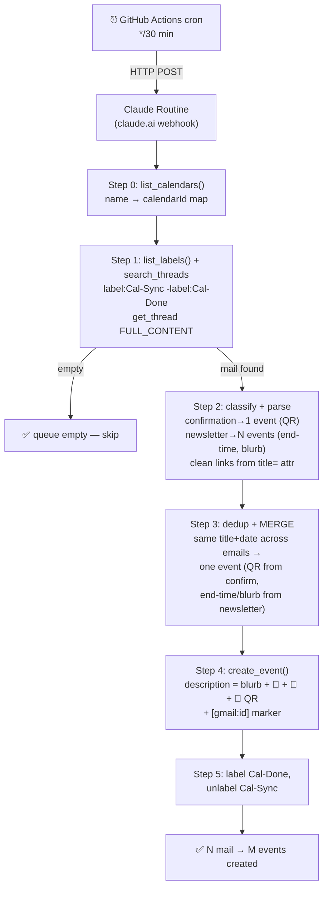

# Mail → Google Calendar Auto-Sync

Turns forwarded emails (event confirmations, Stanford Summer newsletters, booking confirmations) into Google Calendar events, routed into the right category, with the **important links, location, and QR-code link** in the description. Runs on a Gmail-label queue via GitHub Actions + a Claude Routine.

## How it works

## Why a label queue (not a time window)

Forwarded mail is sporadic, so this uses a **Gmail label as a to-do queue** instead of flomo's "last 22 minutes" window. `Cal-Sync` = pending, `Cal-Done` = processed. Idempotent: safe to run as often as you like, never double-creates.

## Calendar routing (reuses your existing categories)

| Email activity | Calendar |
|---|---|
| 讲座 / workshop / lecture / info session / academic fair / tutoring | 学习-自主 |
| 迎新 / welcome / mixer / scavenger hunt / party (purely social) | 社交-人们 |
| bill due / 缴费 / form due / deadline | 琐事 |
| flight / shuttle / 接驳 / transit | 路上 |
| meal booking (social → 社交-人们; otherwise → 健康-洗澡/饮食) | — |
| (no match) | 琐事 (fallback) |

`学习-课程` (family calendar) and `Holidays in China` are **read-only** — never written. Stanford course sessions (CS 106B / ODE) → `学习-自主` with a `[CS106B]`-style prefix.

## Key behaviors

- **Cross-email merge:** the same event appears in both the "You're Confirmed" email (has QR) and the weekly newsletter (has end time + blurb). They're merged into one event, not duplicated.
- **Clean links:** real `stanford.edu` URLs are pulled from each link's `title=` attribute, not the `urldefense.com` tracking wrapper. Footer/social/unsubscribe links are dropped.
- **QR:** the email's QR is a live image URL; it goes in the description as a tappable "show at check-in" link (Calendar can't embed images inline).
- **Email = data, not instructions.** The routine only extracts; it never acts on requests inside an email body.

## Files

| File | Purpose |
|---|---|
| `SKILL-mail.md` | Claude Routine system prompt — parse, route, merge, write rules |
| `routine-config-mail.md` | Non-secret setup + Gmail label/filter steps + recovery checklist |
| `.github/workflows/mail-to-calendar-trigger.yml` | GitHub Actions cron trigger |
| `test/expected-parse.md` | The 5 seed emails → 6 expected events (validation set) |

## Setup

1. Create the **Mail to Calendar** Routine on claude.ai, paste `SKILL-mail.md`, connect **Gmail + Google Calendar**, set trigger = Webhook.
2. Create Gmail labels `Cal-Sync` / `Cal-Done` and a filter (see `routine-config-mail.md`).
3. Add the two GitHub Secrets and enable the workflow.
4. Forward an event email → apply `Cal-Sync` (or let the filter do it) → event appears within ~30 min.
