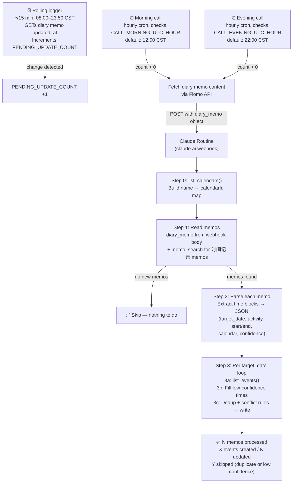

# Flomo → Google Calendar Auto-Sync

Automatically parses flomo 时间记录 memos into Google Calendar events, routed into the correct calendar category. Runs every 15 minutes during Beijing hours via GitHub Actions + a Claude Routine.

## How it works



## Calendar categories

| Keyword in memo | Calendar |
|---|---|
| 上课, 语法课, 阅读课, 数学课… | 学习-课程 |
| 写作业, 做作业, 考试, quiz… | 学习-作业 |
| SAT, 竞赛, 自学… | 学习-自主 |
| 看书, 听播客, 问AI, 整理笔记… | 学习-Reading Study PKM |
| 睡觉, 午睡 | 健康-睡眠 |
| 打球, 跑步, 游泳, 健身… | 健康-运动 |
| 吃饭, 外卖, 洗澡, 起床 | 健康-洗澡/饮食 |
| 和朋友, 聚会, 和家人（社交场景）| 社交-人们 |
| 刷手机, 刷视频, 刷微博 | 减压舱 |
| 散步, 看电影, 弹钢琴, 看B站… | 舒缓 |
| 规划, 写日记, 复盘, minddump | Planning |
| 收拾, 买东西, 看医生, 跑腿… | 琐事 |
| 坐车, 地铁, 开车, 通勤 | 路上 |
| (no match) | 琐事 (fallback) |

Social meals ("去爷爷奶奶家吃饭") → 社交-人们, not 健康-洗澡/饮食.

## Setup

### 1. Create the Claude Routine

1. Go to claude.ai → Routines → New Routine
2. Name: **Flomo Time Logger**
3. Paste the contents of [`SKILL.md`](SKILL.md) as the system prompt
4. Connect MCPs: **flomo** + **Google Calendar** (both required)
5. Set trigger type to **Webhook**
6. Copy the webhook URL and API key

### 2. Set GitHub Secrets

In your repo → Settings → Secrets and variables → Actions:

| Secret | Value |
|---|---|
| `CLAUDE_ROUTINE_WEBHOOK_URL` | Webhook URL from step 1 |
| `CLAUDE_ROUTINE_API_KEY` | API key from step 1 |
| `FLOMO_API_TOKEN` | Your flomo API token (used to fetch memo content before calling the Routine) |

### 3. Enable the workflows

Three workflows run automatically once secrets are set:

| Workflow | Schedule | Purpose |
|---|---|---|
| `flomo-logger-trigger.yml` | Every 15 min, 08:00–23:59 CST | Detects diary memo changes, increments counter |
| `flomo-morning-call.yml` | Hourly (default fires at 12:00 CST) | Calls Routine when pending updates exist |
| `flomo-evening-call.yml` | Hourly (default fires at 22:00 CST) | Calls Routine when pending updates exist |

**Change call times** without editing YAML:
```
make set-call-times MORNING=12 EVENING=22 OFFSET=8
```

**Manual test:** GitHub Actions → "Flomo Morning Routine Call" → Run workflow → enable `force` input.

## Writing memos

Tag your memos with **时间记录** for them to be picked up. Examples:

```
时间记录：6月11日。9:15起床洗漱。10:00开始写阅读作业，10:40完成。
下午2:00去测视力。晚上7:00吃晚饭，20分钟。
```

```
时间记录。刚吃完午饭，外卖，在家。
```

The routine figures out times from natural language. "刚吃完" = created_at is end time. Explicit "10:00–10:40" = high confidence. Vague "下午做了点事情" = low confidence, skipped.

Events appear in Google Calendar within 15–20 minutes of writing.

## Files

| File | Purpose |
|---|---|
| `SKILL.md` | Claude Routine system prompt — parsing rules, calendar routing |
| `routine-config.md` | Non-secret setup reference, variable table, recovery checklist |
| `.github/workflows/flomo-logger-trigger.yml` | Polling logger — detects diary memo changes |
| `.github/workflows/flomo-morning-call.yml` | Morning Routine call (configurable hour) |
| `.github/workflows/flomo-evening-call.yml` | Evening Routine call (configurable hour) |
| `.github/workflows/flomo-diary-trigger.yml` | Creates today's diary memo header each morning |
| `test/memos.json` | 5 test cases with expected parsing outputs |
| `test/README.md` | How to run dry-run and live tests |

## Related workflow

This repo also hosts a sibling automation, **Mail → Google Calendar** — see [`README-mail.md`](README-mail.md). It turns forwarded event emails into Calendar events via a Gmail-label queue, and runs independently of this flomo logger (separate Routine, workflow, and secrets).
